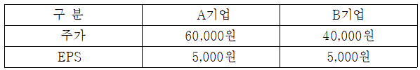
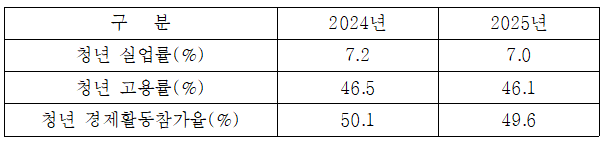
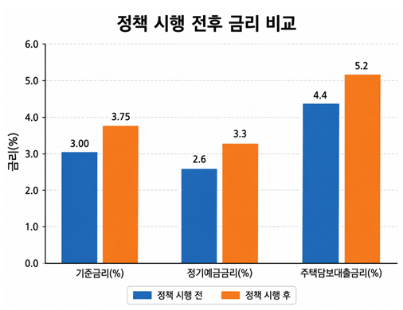
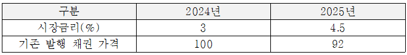
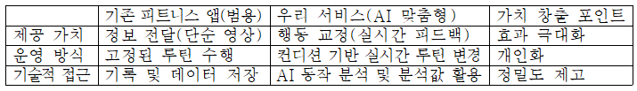
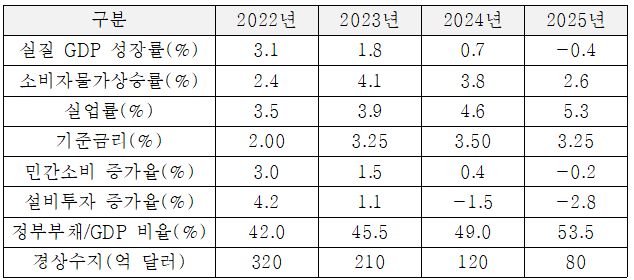

# AI-POT 1급 테스트 제공 문제 추출

원본 문제 페이지의 본문과 선택지를 Markdown으로 옮기고, 표·차트·이미지는 `assets/`에 보관했습니다. 이미지 안의 읽을 수 있는 표·차트 텍스트도 아래에 Markdown으로 전사했습니다.

## 정답 및 해설 작성 기준

객관식·단답형은 문항의 보기와 제시문을 근거로 정답을 제시했습니다. 18·19번은 원본 페이지에서 참조하라고 한 전제 자료가 보이지 않아 추정임을 표시했습니다. 35–40번 서술형은 [AI-POT AI프롬프트활용능력 1급 기본서_구매인증자료.pdf](</home/cgma/cgma_git/study/aipot/AI-POT AI프롬프트활용능력 1급 기본서_구매인증자료.pdf>)의 실기 안내·공개문제 해설을 참고했습니다. 기본서는 완성된 문장형 프롬프트 작성과 모든 필수 조건의 명시를 강조하므로, 해당 문항에는 단일한 ‘정답’ 대신 제출 가능한 예시와 필수 요소를 제시합니다.

## 원본 페이지

- https://license.kpc.or.kr/html/aiexam/aibt1/AIBTPart1_3.html
- https://license.kpc.or.kr/html/aiexam/aibt1/AIBTPart2_1.html
- https://license.kpc.or.kr/html/aiexam/aibt1/AIBTPart2_2.html
- https://license.kpc.or.kr/html/aiexam/aibt1/AIBTPart2_3.html
- https://license.kpc.or.kr/html/aiexam/aibt1/AIBTPart2_4.html
- https://license.kpc.or.kr/html/aiexam/aibt1/AIBTPart2_5.html
- https://license.kpc.or.kr/html/aiexam/aibt1/AIBTPart2_6.html

## 범위 확인

제공된 페이지를 기준으로 실제 화면에 표시된 문제 번호는 1번부터 40번까지입니다. Part 1 페이지에는 1–34번, Part 2의 여섯 페이지에는 35–40번이 표시됩니다. (Part 2의 첫 다섯 문서는 내부 섹션 ID와 화면 문제 번호가 한 칸씩 어긋나며, `AIBTPart2_6.html`에서 40번 문항이 이어집니다.)

> 공통 시험 화면 요소(타이머, 로고, 답안 입력창, 중간저장 안내 등)는 문제 내용이 아니므로 제외했습니다. 정답은 원본 페이지에 제공되지 않아 포함하지 않았습니다.

## 문제 1

원본: https://license.kpc.or.kr/html/aiexam/aibt1/AIBTPart1_3.html

다층 퍼셉트론(MLP)의 등장으로 인공지능이 1차 암흑기를 극복하고 2차 황금기를 맞게 된 핵심적인 기술적 배경으로 가장 적절한 것은?

### 선택지

1. 단층 구조로는 풀 수 없었던 비선형적(XOR) 복잡한 문제의 해결
2. 기울기 소멸 현상을 막기 위한 ReLU 활성화 함수의 전면적 도입
3. 대규모 데이터 학습을 감당할 수 있는 고성능 GPU 연산력의 발전
4. 판별자와 생성자의 경쟁을 활용한 고품질 이미지 생성 알고리즘 개발

### 정답 및 근거

**정답: ① 단층 구조로는 풀 수 없었던 비선형적(XOR) 복잡한 문제의 해결**

다층 퍼셉트론은 은닉층과 비선형 활성화 함수를 통해 선형 분리가 불가능한 XOR 같은 문제를 표현할 수 있다. 이는 단층 퍼셉트론의 한계를 넘어선 핵심 배경이다.
## 문제 2

원본: https://license.kpc.or.kr/html/aiexam/aibt1/AIBTPart1_3.html

다음 사례에서 로봇이 주변 환경과 상호작용하면서 최적의 이동 정책을 찾아내도록 적용해야 할 머신러닝 학습 방식으로 가장 올바른 것을 고르면?

### 제시문 / 요구 결과

대형 물류 기업 A사는 물류창고 내 자율주행 로봇을 도입하려고 한다. 이 로봇은 인간이 미리 동선을 코딩해 주지 않아도, 수많은 장애물을 피하며 스스로 목적지까지 최단 경로로 이동하는 방법을 학습해야 한다.

### 선택지

1. 과거의 매출액과 수요 데이터를 바탕으로 미래를 예측하는 선형 회귀 지도학습
2. 사전에 정답이 없는 상태에서 고객의 행동 데이터 간 유사성을 묶어주는 비지도학습
3. 환경 안에서 시행착오를 거치며 보상을 최대화하는 행동을 스스로 찾아내는 강화학습
4. 입력 텍스트의 맥락을 파악해 다음에 올 가장 확률 높은 단어를 예측하는 대규모 언어모델

### 정답 및 근거

**정답: ③ 강화학습**

로봇이 환경과 상호작용하고, 장애물 회피·목적지 도달에 대한 보상을 바탕으로 최적 정책을 찾는 문제이므로 강화학습에 해당한다.
## 문제 3

원본: https://license.kpc.or.kr/html/aiexam/aibt1/AIBTPart1_3.html

생성형 AI의 두뇌 역할을 하는 거대 언어 모델(LLM)은 방대한 데이터를 통해 지식을 습득하고 특정 작업에 맞춰 진화하는 두 가지 주요 학습 단계를 거친다. 거대 언어 모델(LLM)의 두 번째 학습 단계인 '미세 조정(Fine-tuning)'의 목적으로 가장 적절한 것은?

### 선택지

1. 언어의 기본 문법과 광범위한 일반 지식을 처음부터 무에서 유로 새롭게 학습하는 것
2. 사전 학습된 모델에 최소한의 정보를 수정하여 특정 도메인 작업에 최적화하는 것
3. 모델의 가중치를 완전히 초기화하여 과거 편향 데이터를 완벽하게 삭제하는 것
4. 모델 학습 과정을 생략하고 실시간 외부 검색 결과만으로 답변을 임시로 구성하는 것

### 정답 및 근거

**정답: ② 사전 학습된 모델에 최소한의 정보를 수정하여 특정 도메인 작업에 최적화하는 것**

미세 조정은 사전 학습 모델의 지식을 바탕으로 특정 도메인·과업 데이터에 맞게 추가 학습해 성능을 조정하는 과정이다.
## 문제 4

원본: https://license.kpc.or.kr/html/aiexam/aibt1/AIBTPart1_3.html

다음 사례에서 치명적 정보 오류를 차단하고, AI가 반드시 당해 연도 사내 최신 약관만을 근거로 답변하도록 시스템을 설계하는 기술로 가장 올바른 것은?

### 제시문 / 요구 결과

금융회사가 고객 상담을 위해 거대 언어 모델(LLM) 기반의 챗봇을 도입했으나, AI가 실재하지 않는 고금리 대출 상품을 안내하는 심각한 환각(Hallucination) 현상이 발생하여 신뢰성 문제가 불거졌다.

### 선택지

1. 검색 증강 생성(RAG) 기술
2. 변이형 자동 인코더(VAE) 기술
3. 토픽 모델링(Topic Modeling) 기법
4. Temperature 하이퍼파라미터 최대화 적용

### 정답 및 근거

**정답: ① 검색 증강 생성(RAG) 기술**

최신 약관을 검색해 그 근거를 답변에 주입하면 모델의 일반 지식에만 의존하는 환각을 줄일 수 있다. 실제 운영에서는 문서 근거가 없을 때 답변을 보류하도록 함께 설계해야 한다.
## 문제 5

원본: https://license.kpc.or.kr/html/aiexam/aibt1/AIBTPart1_3.html

다음 사례에서 사용된 핵심 AI 알고리즘과 그 특징으로 가장 적절한 것은?

### 제시문 / 요구 결과

B 엔터테인먼트 기업은 과거 사망한 유명 배우의 얼굴과 음성을 인공지능으로 정교하게 복원하여 상업 광고를 성공적으로 제작했다. 그러나 동일한 기술이 자사 CEO의 얼굴과 목소리를 합성한 허위 피싱 영상 범죄에도 악용되어 사회적 논란이 되었다.

### 선택지

1. 변이형 자동 인코더(VAE)
2. 군집화 기반의 비지도학습
3. 생성적 적대 신경망(GAN)
4. 정적 임베딩인 Word2Vec 기법

### 정답 및 근거

**정답: ③ 생성적 적대 신경망(GAN)**

GAN은 생성자와 판별자가 경쟁하며 사실적인 이미지·음성 등을 생성하는 구조다. 얼굴·음성 합성(딥페이크)에 악용될 수 있다는 사례와 일치한다.
## 문제 6

원본: https://license.kpc.or.kr/html/aiexam/aibt1/AIBTPart1_3.html

구글의 제미나이(Gemini) 모델을 기반으로 구동되는 '노트북LM(NotebookLM)'이 제공하는 가장 핵심적인 서비스 특징으로 올바른 것은?

### 선택지

1. 사용자가 직접 업로드한 문서만 근거로 삼아 허위 정보를 최소화하고, 답변 시 출처를 반드시 인용한다.
2. 텍스트 명령어만 입력하면 빛의 굴절과 물리 법칙까지 반영된 초고화질 3D 비디오를 실시간으로 자동 생성한다.
3. 개발 환경 구축 없이도 자연어를 입력하면 복잡한 파이썬(Python) 프로그램을 백그라운드에서 자동 완성한다.
4. 사용자의 목소리 톤을 그대로 복제하여, 외국어 입력 시 원어민 수준의 감정을 담아 실시간 동시통역을 제공한다.

### 정답 및 근거

**정답: ① 사용자가 업로드한 문서를 근거로 답하고 출처를 인용하는 기능**

NotebookLM의 핵심은 사용자가 제공한 소스를 기반으로 요약·질의응답을 수행하고, 답변의 근거 위치를 제시하는 데 있다.
## 문제 7

원본: https://license.kpc.or.kr/html/aiexam/aibt1/AIBTPart1_3.html

다음 사례에서 특정 업무 수행에 필요한 지침, 도구, 규칙을 하나의 패키지로 묶어 조직 내에 배포함으로써 직원들의 프롬프트 입력 편차를 줄이고 표준화된 결과물을 얻게 하는 기능으로 가장 올바른 것은?

### 제시문 / 요구 결과

대기업 영업기획팀은 생성형 AI를 업무에 적극 도입했으나, 직원마다 입력하는 프롬프트의 퀄리티가 달라 산출되는 보고서의 품질이 들쭉날쭉한 문제를 겪고 있다. 경영진은 누구나 일관되고 전문적인 보고서를 출력할 수 있도록 해결책을 요구했다.

### 선택지

1. 길고 복잡한 프롬프트 작성 없이도 등록된 전문 지식을 자동 호출하는 클로드 스킬
2. 텍스트 속 글자를 이미지 내에 정확하게 렌더링하고 사실적 질감을 표현하는 나노 바나나
3. 복잡한 이미지나 문서의 특징을 잠재 공간에 벡터 형태로 압축하여 저장하는 인코더 구조
4. 학습 데이터의 편향을 막기 위해 과거 대화 기록과 문맥을 완전히 삭제 후 실행하는 제로샷 러닝

### 정답 및 근거

**정답: ① 클로드 스킬**

특정 업무의 지침·도구·규칙을 패키지화하여 구성원에게 재사용하게 하는 기능이므로, 업무별 표준화된 결과를 돕는 스킬의 설명에 해당한다.
## 문제 8

원본: https://license.kpc.or.kr/html/aiexam/aibt1/AIBTPart1_3.html

자연어 처리 모델인 트랜스포머 아키텍처의 핵심 원리와 특징으로 가장 올바른 것을 고르면?

### 선택지

1. 문장의 단어들을 반드시 순서대로 하나씩 직렬로 처리하여 컴퓨팅 연산 자원의 소모를 줄인다.
2. 어텐션(Attention) 모델을 활용하여 문장 내 모든 단어 쌍의 관계 점수를 병렬로 동시 처리한다.
3. 학습 데이터에 인위적으로 노이즈를 섞었다가 다시 제거하는 역과정을 통해 콘텐츠를 생성한다.
4. 판별자와 생성자라는 두 개의 신경망이 서로 경쟁하며 사실적인 가짜 데이터를 지속적으로 만들어낸다.

### 정답 및 근거

**정답: ② 어텐션으로 문장 내 단어 관계를 병렬 처리한다**

트랜스포머는 self-attention으로 토큰 간 관계를 계산하고, RNN처럼 순차 처리하지 않아 병렬 연산이 가능하다.
## 문제 9

원본: https://license.kpc.or.kr/html/aiexam/aibt1/AIBTPart1_3.html

거대 언어 모델(LLM)을 제어하는 프롬프트 엔지니어링의 핵심 특징과 최근 발전 방향에 대한 설명으로 가장 올바른 것은?

### 선택지

1. 명령을 한 번만 내려 단답형 결과를 얻는 단발성 지시 형태로 굳어지고 있다.
2. 모델의 가중치를 직접 수정하여 기계학습 성능을 높이는 기술로 발전하고 있다.
3. 정형화된 데이터 포맷(JSON, CSV 등)보다 자유로운 산문 형태의 출력을 지향한다.
4. AI에게 상황과 업무 맥락을 전달하는 '맥락 설계(Context Design)'가 핵심이 되고 있다.

### 정답 및 근거

**정답: ④ 맥락 설계(Context Design)**

최근 프롬프트 엔지니어링은 단발 명령보다 역할, 배경, 자료, 제약, 출력 형식 등 필요한 맥락을 설계해 모델의 응답을 통제하는 방향으로 발전했다.
## 문제 10

원본: https://license.kpc.or.kr/html/aiexam/aibt1/AIBTPart1_3.html

다음 사례를 분석하여, SCQA 패턴 중 평온한 상황을 흔드는 구체적인 난관을 제시하여 AI가 집중해야 할 문제를 정의하는 단계에 해당하는 것은?

### 제시문 / 요구 결과

신사업 기획팀 이 팀장은 AI를 활용하여 경영진에게 보고할 '헬스케어 신규 앱 출시 기획안'의 초안을 작성하려고 한다. 이 팀장은 SCQA 논리 구조를 프롬프트에 적용하여 설득력을 높이려 한다.

### 선택지

1. Situation (상황)
2. Complication (전개)
3. Question (질문)
4. Answer (답변)

### 정답 및 근거

**정답: ② Complication(전개)**

SCQA에서 Complication은 기존 상황의 평온함을 깨는 문제·장애를 제시해 해결해야 할 쟁점을 부각하는 단계다.
## 문제 11

원본: https://license.kpc.or.kr/html/aiexam/aibt1/AIBTPart1_3.html

프롬프트 출력 결과에서 이미 등장한 주제의 반복을 억제하고, 새로운 텍스트나 완전히 새로운 주제의 등장을 촉진하기 위해 조정해야 할 하이퍼파라미터로 올바른 것을 고르면?

### 선택지

1. Temperature
2. Top-p
3. Frequency Penalty
4. Presence Penalty

### 정답 및 근거

**정답: ④ Presence Penalty**

Presence penalty는 이미 등장한 토큰·주제의 재등장을 억제해 새로운 내용이나 주제의 출현을 유도한다. Frequency penalty는 같은 표현의 반복 빈도 자체를 낮추는 데 더 직접적이다.
## 문제 12

원본: https://license.kpc.or.kr/html/aiexam/aibt1/AIBTPart1_3.html

다음 사례에서 사용된 AI에게 공식 답변 매뉴얼을 부여하고, 절대 규정을 벗어난 확답을 하지 않도록 통제하는 데 가장 최적화된 프롬프트 설계 패턴은?

### 제시문 / 요구 결과

온라인 쇼핑몰 CS팀은 환불 규정을 안내하는 AI 챗봇을 도입하려 한다. 그러나 테스트 결과, AI가 친절하게 답하려는 강박 때문에 규정에 없는 전액 환불을 약속하는 치명적인 오류를 범했다.

### 선택지

1. 감정 자극에 최적화된 PAS 패턴
2. 논리적 기획안을 도출하는 SCQA 패턴
3. 데이터 분석을 위한 Insight-Action 패턴
4. 정체성과 지침을 강제하는 Persona-Guide 패턴

### 정답 및 근거

**정답: ④ Persona-Guide 패턴**

AI의 역할과 준수해야 할 공식 매뉴얼·금지 규칙을 명시해 답변 범위를 통제해야 하므로, 정체성과 지침을 강제하는 Persona-Guide 패턴이 적절하다.
## 문제 13

원본: https://license.kpc.or.kr/html/aiexam/aibt1/AIBTPart1_3.html

생성형 AI에게 복잡한 논리적 질문을 던질 때, 다양한 추론 경로(예제)를 제공하여 도출된 여러 결과 중 '가장 일관되게 나타난 다수결의 답변'을 최종 선택하게 유도하는 학습 기법은?

### 선택지

1. 퓨샷 러닝 (Few-shot Learning)
2. 제로샷 러닝 (Zero-shot Learning)
3. 제로샷 CoT (Zero-shot Chain of Thought)
4. 자기 일관성 러닝 (Self-consistency Learning)

### 정답 및 근거

**정답: ④ 자기 일관성 러닝(Self-consistency Learning)**

여러 추론 경로를 생성한 뒤 가장 일관되게 반복되는 답을 선택하는 방식이 자기 일관성(Self-consistency)이다.
## 문제 14

원본: https://license.kpc.or.kr/html/aiexam/aibt1/AIBTPart1_3.html

다음 사례를 참고하여 AI의 환각 현상을 원천 차단하고 사내 데이터의 신뢰성을 확보하기 위해 시스템 프롬프트에 추가할 '논리적 가드레일'로 가장 올바른 것을 고르면?

### 제시문 / 요구 결과

금융회사가 사내 최신 보안 규정이 담긴 문서를 RAG(검색 증강 생성) 방식으로 연동하여 직원용 AI 챗봇을 구축했다. 그러나 질문에 대한 답이 연동된 문서에 없을 때, AI가 일반 웹 지식을 섞어 그럴듯한 규정을 창작(할루시네이션)하는 문제가 생겼다.

### 선택지

1. 문서에 답이 없으면 스스로 유추하여 가장 합리적인 결론을 창작하라.
2. 창의적인 답변을 위해 Temperature 값을 최대로 높여서 출력하라.
3. 문서에 답이 없다면 절대 추측하지 말고 '알 수 없습니다'라고 출력하라.
4. 더 많은 정보를 제공하기 위해 외부 웹 검색 결과를 무조건 포함하라.

### 정답 및 근거

**정답: ③ 문서에 답이 없다면 추측하지 말고 ‘알 수 없습니다’라고 출력한다**

RAG 문서에 근거가 없을 때 모델의 일반 지식이나 추측을 섞지 않도록 명시적으로 차단하는 가드레일이다.
## 문제 15

원본: https://license.kpc.or.kr/html/aiexam/aibt1/AIBTPart1_3.html

악의적인 사용자가 교묘한 지시를 통해 AI의 원래 목적을 망각하게 만들거나, 내부 시스템 지침(시스템 프롬프트)을 탈취하려는 공격을 방어하는 전략으로 가장 적절한 것은?

### 선택지

1. 사용자의 입력값을 '명령'이 아닌 단순 '참조 데이터'로만 인식하도록 격리한다.
2. AI가 생성하는 모든 텍스트 결과물에 디지털 워터마크를 의무적으로 삽입한다.
3. 프롬프트 내에 존재하는 개인정보를 모두 가명으로 치환하는 전처리를 수행한다.
4. 확산 모델(Diffusion Models)을 적용하여 악의적인 입력을 노이즈로 변환한다.

### 정답 및 근거

**정답: ① 사용자 입력을 명령이 아닌 참조 데이터로 격리한다**

프롬프트 인젝션 방어의 핵심은 신뢰 경계와 지시 우선순위를 분리하는 것이다. 외부·사용자 입력을 시스템 지시처럼 실행하지 않게 처리해야 한다.
## 문제 16

원본: https://license.kpc.or.kr/html/aiexam/aibt1/AIBTPart1_3.html

다음 사례에서 사용된 원본 이미지를 눈에 띄게 훼손하지 않으면서도, AI 모델이 해당 그림의 스타일을 전혀 다른 형태로 인식하게 만들어 무단 화풍 모방을 원천 방해하는 보안 기술로 올바른 것은?

### 제시문 / 요구 결과

웹툰 제작사 A 기업은 자사 소속 작가들의 독창적인 화풍이 무단으로 생성형 AI의 학습 데이터로 사용되어, 스타일이 그대로 모방된 유사 웹툰이 무분별하게 생성되는 위협에 직면했다.

### 선택지

1. 포토가드(PhotoGuard)
2. 토픽 모델링 (Topic Modeling)
3. 프로젝트 글레이즈 (Project Glaze)
4. 스테이블 디퓨전 (Stable Diffusion)

### 정답 및 근거

**정답: ③ 프로젝트 글레이즈(Project Glaze)**

Glaze는 사람 눈에는 큰 변화가 없지만 AI가 화풍을 다르게 인식하도록 스타일 교란을 가해 무단 스타일 모방을 어렵게 한다.
## 문제 17

원본: https://license.kpc.or.kr/html/aiexam/aibt1/AIBTPart1_3.html

경영 현장의 리스크를 선제적으로 파악하기 위해 생성형 AI에 입력할 프롬프트를 설계하고자 한다. 다음 중 리스크 탐색을 위한 질문 설계 방식으로 가장 적절한 것은?

### 선택지

1. 경영 현장에 존재하는 리스크가 무엇인지 단순히 식별하고 나열하는 수준에서 질문해야 한다.
2. 리스크를 단편적으로 보지 않고 거시환경, 산업 구조, 기업 내부를 통합적으로 고려해야 한다.
3. 모든 질문이 궁극적으로 내부 운영 효율성 저하를 방지하기 위한 통제 수단으로 작용하도록 설계해야 한다.
4. 전략 방향이 시장 변화와 괴리될 경우 발생할 수 있는 리스크는 환경적 변수가 너무 크므로 고려하지 않아야 한다.

### 정답 및 근거

**정답: ② 거시환경, 산업 구조, 기업 내부를 통합적으로 고려한다**

리스크는 단일 원인이 아니라 외부 환경·산업·조직 내부 요인이 결합해 발생할 수 있으므로, 통합적 질문 설계가 필요하다.
## 문제 18

원본: https://license.kpc.or.kr/html/aiexam/aibt1/AIBTPart1_3.html

A 기업의 경영기획팀 김 대리는 효율적인 사업 포트폴리오 전략을 수립하기 위해 생성형 AI를 활용하여 BCG 매트릭스 분석을 수행하고자 한다. 제시문의 조건과 생성형 AI의 분석 결과를 바탕으로 빈칸 ( ㉠ )에 유도될 가장 적절한 사업 영역을 프롬프트 명령어의 핵심 키워드로 선택한 것은?

### 선택지

1. 스타
2. 도그
3. 물음표
4. 캐시카우

### 정답 및 근거

**정답(추정): ③ 물음표**

BCG 매트릭스에서 시장 성장성은 높지만 상대적 점유율이 낮은 사업은 물음표(Question Mark)이며, 육성 투자 또는 철수의 선택이 필요하다. 다만 원본 페이지에는 문제에서 참조한 ‘제시문의 조건’과 AI 분석 결과가 표시되어 있지 않아, 선택지와 19번의 문맥을 바탕으로 한 추정이다.
## 문제 19

원본: https://license.kpc.or.kr/html/aiexam/aibt1/AIBTPart1_3.html

다음 중 생성형 AI가 제안한 다차원적 분석 결과를 토대로, 김 대리가 ‘뷰티 사업부’를 위한 최종 프롬프트 의사결정 가이드라인에 반영할 전략 실행 방안으로 가장 적절한 것은?

### 선택지

1. 자원의 효율성을 고려해 사업 규모를 축소한다.
2. 시장 주도권을 계속 유지하기 위해 지속적으로 투자한다.
3. 집중적으로 키울지, 아니면 철수할지를 선별적으로 판단해야 한다.
4. 기업에 대규모 자금을 공급하는 안정적인 현금 창출원으로 관리한다.

### 정답 및 근거

**정답(추정): ③ 집중 육성 또는 철수를 선별적으로 판단한다**

물음표 사업은 투자해 스타로 키울지, 회수·철수할지 판단하는 BCG 전략을 따른다. 원본 페이지에 전제 자료가 누락되어 있으므로, 18번과 선택지의 BCG 대응 관계를 근거로 한 추정이다.
## 문제 20

원본: https://license.kpc.or.kr/html/aiexam/aibt1/AIBTPart1_3.html

다음 사례에서 AI 시스템이 도출한 결과와 가장 관련이 깊은 SWOT 분석의 전략적 제안은?

### 제시문 / 요구 결과

A 기업의 경영기획 부서는 AI 기반의 ‘전략 수립 지원 시스템’을 도입했다. 이 시스템은 담당자가 자사의 내부 역량과 외부 환경 동향을 입력하면, 이를 다양하게 교차 분석하여 맞춤형 비즈니스 시나리오를 제공해 준다. 이번 신사업 기획에서 담당자인 김 대리가 ‘자사의 업계 최고 수준의 독점 기술력과 강력한 브랜드 인지도’를 입력하고, 이와 함께 ‘글로벌 신흥 시장의 폭발적인 성장과 규제 완화’ 데이터를 입력하자, 이 시스템은 ‘자사의 독점 기술력을 활용해 규제가 완화된 글로벌 신흥 시장을 선점하는 공격적인 마켓 개척 방안’과 ‘강력한 브랜드 인지도를 지렛대 삼아 폭발적으로 성장하는 신흥 시장의 수요를 흡수할 차세대 신제품 출시 로드맵’을 핵심 아웃풋으로 도출했다.

### 선택지

1. ST 전략
2. SO 전략
3. WT 전략
4. WO 전략

### 정답 및 근거

**정답: ② SO 전략**

독점 기술·강한 브랜드라는 강점(S)을 신흥시장 성장·규제 완화라는 기회(O)에 활용하므로 SO 전략이다.
## 문제 21

원본: https://license.kpc.or.kr/html/aiexam/aibt1/AIBTPart1_3.html

다음은 김 대리가 생성형 AI에 자사의 주요 재무제표 데이터를 입력하고 받은 분석 결과이다. 생성형 AI가 진단하고 있는 재무 비율의 범주로 가장 적절한 것은?

### 제시문 / 요구 결과

입력하신 데이터를 자동 계산하여 진단한 결과입니다.
·재고자산 회전율 변동: 최근 시장 경쟁 심화로 인해 재고자산 회전율이 전년도 6.5회에서 당해 연도 4.2회로 크게 감소했습니다. 창고에 상품이 머무는 기간이 길어지고 있으므로 재고 진부화 리스크 및 관리 비용 증가에 대비해야 합니다.
·매출채권 회전율 변동: 대금 회수 정책 강화 효과로 매출채권 회전율은 전년도 8.0회에서 당해 연도 11.5회로 눈에 띄게 개선되었습니다. 외상 매출금의 현금화 속도가 빨라져 대손 발생 가능성이 낮아졌습니다.
·총자산 회전율 진단: 총자산 회전율은 1.2회로 업계 평균 수준을 유지하고 있습니다.

### 선택지

1. 성장성 비율
2. 수익성 비율
3. 안정성 비율
4. 활동성 비율

### 정답 및 근거

**정답: ④ 활동성 비율**

재고자산·매출채권·총자산 회전율은 자산이 얼마나 효율적으로 활용되는지를 보는 활동성(효율성) 비율이다.
## 문제 22

원본: https://license.kpc.or.kr/html/aiexam/aibt1/AIBTPart1_3.html

다음 사례에서 생성형 AI가 김 과장이 입력한 재무상태표 데이터만을 활용하여 진단할 수 있는 질문으로 가장 적절하지 않은 것은?

### 제시문 / 요구 결과

A 기업의 재무팀 김 과장이 신규 협력업체의 부도 위험을 사전에 감지하고 신용 상태를 평가하기 위해, 신규 협력업체의 최근 재무상태표 데이터를 생성형 AI에 입력하고 분석을 요청했다.

### 선택지

1. 기업이 보유하고 있는 현금은 얼마나 되는가
2. 자본 총액 대비 부채 총액이 과도하여 재무적 위험이 발생할 가능성은 어떠한가
3. 전체 자산 중에서 재고자산의 비중이 지나치게 높아 기업의 자금이 고여 있지는 않은가
4. 기업의 이익잉여금은 영업외수익으로 일시에 쌓인 것인가 아니면 본업의 꾸준한 영업이익으로 축적된 것인가

### 정답 및 근거

**정답: ④ 이익잉여금이 영업외수익인지 본업 영업이익인지 판단하는 질문**

재무상태표만으로는 이익잉여금의 형성 원인이나 손익의 성격을 알기 어렵고, 손익계산서·주석 등 추가 자료가 필요하다.
## 문제 23

원본: https://license.kpc.or.kr/html/aiexam/aibt1/AIBTPart1_3.html

다음 사례를 바탕으로 주식 분석 태도로 가장 적절한 것은?

### 제시문 / 요구 결과

경제학과 4학년인 지수는 생성형 AI에게 “반도체 기업 주가가 최근 크게 오른 이유를 정리해 줘”라고 요청하였다. AI는 실적 기대, 업황 회복, 금리 인하 기대, 외국인 수급 개선 등을 제시하였다.

### 선택지

1. AI가 제시한 이유 중 하나만 골라서 곧바로 확정적 결론을 내린다.
2. AI 설명을 참고하되 실적 자료, 공시, 금리 흐름을 함께 확인한다.
3. 주가가 올랐으므로 그 기업은 무조건 우량기업이라고 본다.
4. 최근 주가 흐름만 보면 기업 분석은 필요 없다.

### 정답 및 근거

**정답: ② AI 설명을 참고하되 실적 자료, 공시, 금리 흐름을 함께 확인한다**

생성형 AI의 요약은 분석의 출발점일 뿐이다. 투자 판단 전에는 기업 공시·실적과 거시 변수 등 검증 가능한 자료를 교차 확인해야 한다.
## 문제 24

원본: https://license.kpc.or.kr/html/aiexam/aibt1/AIBTPart1_3.html

[단답형] 다음에서 설명하는 활성화 함수를 작성하시오.

### 제시문 / 요구 결과

투자분석팀의 하늘은 AI에게 “두 기업의 PER을 비교해 어느 기업이 상대적으로 저평가되었을 가능성이 있는지 설명해 줘”라고 요청하였다.

인공지능 답변

( ㉠ ) 일반적으로 같은 업종과 성장성이라는 전제가 비슷하다면, PER이 더 낮은 기업이 상대적으로 저평가되었을 가능성을 생각해볼 수 있다. 다만 이 한 지표만으로 단정해서는 안 된다.

### 시각 자료 텍스트 전사

**표 텍스트 전사**

| 구분 | A기업 | B기업 |
| --- | ---: | ---: |
| 주가 | 60,000원 | 40,000원 |
| EPS | 5,000원 | 5,000원 |

### 선택지

1. A기업의 PER은 8배, B기업의 PER은 12배이다.
2. A기업의 PER은 12배, B기업의 PER은 8배이다.
3. A기업과 B기업의 PER은 같다.
4. B기업의 PER은 5배이다.

### 정답 및 근거

**정답: ① A기업 PER 12배, B기업 PER 8배**

PER은 주가 ÷ EPS다. A기업은 60,000 ÷ 5,000 = 12배, B기업은 40,000 ÷ 5,000 = 8배다. 원문 제목의 ‘활성화 함수’ 표기는 제시문·선택지와 맞지 않는 것으로 보이며, 계산형 선택지를 기준으로 판단했다.
## 문제 25

원본: https://license.kpc.or.kr/html/aiexam/aibt1/AIBTPart1_3.html

다음 보고서 자료와 AI의 해석을 읽고, 청년층 고용 상황에 대한 판단으로 가장 적절한 것은?

### 제시문 / 요구 결과

투자분석팀의 하늘은 AI에게 “두 기업의 PER을 비교해 어느 기업이 상대적으로 저평가되었을 가능성이 있는지 설명해 줘”라고 요청하였다.

다연은 이 자료를 AI에게 입력하고 다음과 같이 질문하였다.

“이 자료를 바탕으로 청년층 고용 상황이 개선되었다고 볼 수 있는지 해석해 줘.”

AI는 다음과 같이 답하였다.
청년 실업률은 2024년 7.2%에서 2025년 7.0%로 낮아졌다. 그러나 같은 기간 청년 고용률은 46.5%에서 46.1%로 하락했고, 경제활동참가율도 50.1%에서 49.6%로 낮아졌다. 따라서 실업률 하락만으로 청년층 고용 상황이 개선되었다고 단정하기는 어렵다. 일부 청년이 취업하지 못한 상태에서 구직 활동을 중단하면 실업자로 분류되지 않아 실업률이 낮아질 수 있기 때문이다.

### 시각 자료 텍스트 전사

**표 텍스트 전사**

| 구분 | 2024년 | 2025년 |
| --- | ---: | ---: |
| 청년 실업률(%) | 7.2 | 7.0 |
| 청년 고용률(%) | 46.5 | 46.1 |
| 청년 경제활동참가율(%) | 50.1 | 49.6 |

### 선택지

1. 청년 실업률이 하락했으므로 청년층의 취업자 수와 고용률은 모두 증가한 것으로 보아야 한다.
2. 청년 실업률은 낮아졌지만 고용률과 경제활동참가율이 함께 하락했으므로, 청년층 고용 상황이 개선되었다고 단정하기 어렵다.
3. 청년 경제활동참가율이 하락하면 실업률은 더 이상 산출할 수 없으므로, 실업률 변화는 의미가 없다.
4. 청년 고용률이 하락했더라도 실업률이 낮아졌다면 노동시장 밖으로 이탈한 사람은 없다고 판단할 수 있다.

### 정답 및 근거

**정답: ② 실업률 하락만으로 청년층 고용 상황 개선을 단정하기 어렵다**

실업률은 낮아졌지만 고용률과 경제활동참가율도 하락했다. 구직 단념 등으로 노동시장 밖으로 이동한 사람이 늘면 실업률만 낮아질 수 있다.
## 문제 26

원본: https://license.kpc.or.kr/html/aiexam/aibt1/AIBTPart1_3.html

다음 자료와 AI의 해석을 바탕으로 예금과 대출 시장에 대한 설명으로 가장 적절한 것은?

### 제시문 / 요구 결과

금융시장 분석팀의 민호는 AI에게 “기준금리 인상이 은행 예금금리와 대출금리에 어떤 영향을 줄 수 있는지 설명해 줘”라고 요청하였다.

### 시각 자료 텍스트 전사

**차트 텍스트 전사 — 정책 시행 전후 금리 비교**

| 금리 | 정책 시행 전 | 정책 시행 후 |
| --- | ---: | ---: |
| 기준금리(%) | 3.00 | 3.75 |
| 정기예금금리(%) | 2.6 | 3.3 |
| 주택담보대출금리(%) | 4.4 | 5.2 |

### 선택지

1. 기준금리 인상은 일반적으로 예금금리와 대출금리를 상승시킨다.
2. 기준금리 인상은 예금금리를 반드시 0으로 만든다.
3. 기준금리 인상은 대출금리와 무관하다.
4. 기준금리 인상은 언제나 금융시장의 자금 수요를 늘린다.

### 정답 및 근거

**정답: ① 기준금리 인상은 일반적으로 예금금리와 대출금리를 상승시킨다**

제시된 차트에서도 기준금리, 정기예금금리, 주택담보대출금리가 모두 상승했다. 실제 전가 폭과 시차는 금융기관·시장 여건에 따라 달라질 수 있다.
## 문제 27

원본: https://license.kpc.or.kr/html/aiexam/aibt1/AIBTPart1_3.html

다음 자료와 AI의 해석을 바탕으로 GDP 구성 항목에 대한 설명으로 가장 올바른 것은?

### 제시문 / 요구 결과

대학교 3학년인 지현은 경제학 수업에서 “GDP를 지출 측면에서 어떻게 이해할 수 있는가”를 주제로 발표를 준비하고 있다. 지현은 AI에게 GDP의 지출 측면 구성요소를 질문했고, AI는 GDP가 소비(C), 투자(I), 정부지출(G), 순수출(X-M)로 구성된다고 설명하였다.

지현은 발표 자료에 다음 사례들을 포함하였다.

- 가계가 국내 음식점에서 식사비를 지출하였다.

- 기업이 생산능력을 높이기 위해 새 기계를 구입하였다.

- 정부가 도로 보수 공사를 위해 민간 건설업체에 공사비를 지급하였다.

- 정부가 실업자에게 실업급여를 지급하였다.

- 국내 투자자가 기존에 발행된 주식을 다른 투자자로부터 매입하였다.

- 국내 기업이 생산한 반도체를 해외에 수출하였다.

- 국내 소비자가 외국산 자동차를 구입하였다.

### 선택지

1. 정부가 실업급여를 지급한 것은 가계의 소득을 증가시키므로 정부지출(G)에 포함된다.
2. 국내 투자자가 기존 주식을 매입한 것은 기업의 자금 조달과 관련되므로 투자(I)에 포함된다.
3. 국내 소비자의 외국산 자동차 구입은 소비(C)에 포함되지만, 동시에 수입(M)으로 차감되어 국내 GDP에는 최종적으로 반영되지 않는다.
4. 정부가 도로 보수 공사를 위해 지출한 금액은 생산 활동과 직접 관련이 없으므로 GDP에 포함되지 않는다.

### 정답 및 근거

**정답: ③ 외국산 자동차 소비는 C에 포함되지만 수입(M)으로 차감된다**

지출접근 GDP는 `C + I + G + (X − M)`이다. 수입품 구입은 소비에 잡히지만 국내 생산이 아니므로 수입으로 차감되어 국내 GDP에 순증하지 않는다.
## 문제 28

원본: https://license.kpc.or.kr/html/aiexam/aibt1/AIBTPart1_3.html

아래 자료는 시장금리 변화와 기존 발행 채권 가격의 변화를 나타낸 것이다. 다음 중 자료를 바탕으로 AI에게 질문하고, AI의 해석을 참고하였다고 할 때, 채권 가격과 시장금리의 관계에 대한 추론으로 가장 적절한 것은?

### 제시문 / 요구 결과

자산시장 분석팀의 예린은 AI에게 “시장금리가 오를 때 채권 가격이 왜 떨어지는지 설명해 줘”라고 요청하였다.

### 시각 자료 텍스트 전사

**표 텍스트 전사**

| 구분 | 2024년 | 2025년 |
| --- | ---: | ---: |
| 시장금리(%) | 3 | 4.5 |
| 기존 발행 채권 가격 | 100 | 92 |

### 선택지

1. 시장금리가 상승하면 새로 발행되는 채권의 이자율이 높아지므로, 기존 채권도 같은 수준의 이자를 지급하게 되어 가격이 하락한다.
2. 시장금리가 상승하면 새로 발행되는 채권에 비해 기존 채권의 수익률 매력이 낮아져, 기존 채권 가격이 하락할 수 있다.
3. 시장금리가 상승하면 기존 채권의 만기 원금은 변하지 않으므로, 기존 채권의 시장 가격도 변하지 않는 것이 일반적이다.
4. 시장금리가 상승하면 채권 투자에서 받을 수 있는 이자 수입이 커지므로, 기존 채권 가격은 상승하는 것이 일반적이다.

### 정답 및 근거

**정답: ② 시장금리 상승 시 기존 채권의 상대적 매력이 낮아져 가격이 하락한다**

새로 발행되는 채권의 금리가 더 높아지면 고정 쿠폰의 기존 채권은 가격이 내려가야 시장수익률이 맞춰진다.
## 문제 29

원본: https://license.kpc.or.kr/html/aiexam/aibt1/AIBTPart1_3.html

다음 중 위의 내용을 기반으로 중앙은행의 통화정책에 대한 일반 원리로 가장 올바르게 추론한 것은?

### 선택지

1. 중앙은행이 기준금리를 인상하면 대출금리가 상승할 수 있으므로 소비와 투자가 위축될 가능성이 있지만, 기준금리 인상은 항상 물가를 즉시 목표 수준까지 낮춘다.
2. 중앙은행의 통화정책은 기준금리, 공개시장조작, 지급준비율 등을 통해 시중 유동성과 금융 여건에 영향을 미치며, 물가 안정과 경기 조절에 활용될 수 있다.
3. 기준금리 인하는 가계와 기업의 차입 비용을 낮출 수 있으므로 경기 부양 효과가 있지만, 통화량과 자산 가격에는 영향을 주지 않는다.
4. 중앙은행의 통화정책은 정부의 재정지출 규모를 직접 결정하는 정책이므로, 기준금리 변화보다 정부 예산 편성이 핵심 수단이다.

### 정답 및 근거

**정답: ② 기준금리·공개시장조작·지급준비율로 유동성과 금융여건에 영향을 준다**

통화정책은 여러 수단으로 물가 안정과 경기 조절을 목표로 하며, 효과는 시차를 두고 나타나므로 ‘항상 즉시’ 같은 단정은 부적절하다.
## 문제 30

원본: https://license.kpc.or.kr/html/aiexam/aibt1/AIBTPart1_3.html

민호가 AI 분석 결과를 실제 통화정책 분석에 활용하려 할 때, 가장 적절한 접근은?

### 선택지

1. AI가 기준금리 인상은 물가를 낮춘다고 설명했으므로, 물가가 높을 때는 경기 상황이나 금융불안 가능성과 관계없이 항상 큰 폭의 금리 인상이 최선이라고 결론 내린다.
2. AI 분석 내용을 참고하되, 물가상승률, 기대인플레이션, 고용지표, GDP 성장률, 환율, 가계부채, 금융시장 변동성 등을 함께 검토한다.
3. AI가 금리 인하 기대를 언급했다면, 실제 중앙은행의 정책 방향도 이미 확정된 것으로 보고 시장 전망을 공식 정책 결정과 동일하게 해석한다.
4. 통화정책은 기준금리 하나로 작동하므로, AI 분석에서 환율·자산가격·기대심리와 같은 파급 경로는 제외하고 현재 기준금리 수준만 비교한다.

### 정답 및 근거

**정답: ② AI 분석을 참고하되 물가·고용·성장·환율·부채·금융시장 변동성을 함께 검토한다**

통화정책은 하나의 지표나 AI 요약만으로 결정할 수 없다. 여러 거시·금융 지표와 위험을 종합적으로 확인해야 한다.
## 문제 31

원본: https://license.kpc.or.kr/html/aiexam/aibt1/AIBTPart1_3.html

아래 상황처럼 대규모 데이터로 언어의 기본 구조를 익힌 '사전 학습(Pre-trained)' 모델에 최소한의 정보를 추가로 수정하여, 특정 도메인이나 작업에 맞게 모델의 성능을 세밀하게 최적화하는 과정은 무엇인지 쓰시오.

### 제시문 / 요구 결과

마케팅팀은 20~30대 친환경 소비자를 표적시장(Targeting)으로 삼아 새로운 제품의 포지셔닝(Positioning) 전략을 수립하려고 한다. 이를 위해 범용적인 거대 언어 모델(LLM)에 자사의 CRM(고객 관계 관리) 데이터와 친환경 제품 관련 고객 피드백 자료를 추가로 학습시켜, 해당 타깃 시장에 최적화된 마케팅 문구를 생성하는 전용 AI 모델을 구축 중이다.

### 답안 형식

단답형 — `( )`

### 정답 및 근거

**정답: 미세 조정(Fine-tuning)**

사전 학습 모델에 도메인 데이터나 과업 데이터를 추가로 학습시켜 특정 목적에 맞게 최적화하는 과정이다.
## 문제 32

원본: https://license.kpc.or.kr/html/aiexam/aibt1/AIBTPart1_3.html

아래 상황처럼 외부 문서나 데이터베이스에서 관련된 최신 정보를 실시간으로 검색한 뒤, 이를 바탕으로 모델이 답변을 생성하게 하여 사전 지식 한계를 보완하고 환각(Hallucination) 현상을 차단하는 시스템 구조는 무엇인지 쓰시오.

### 제시문 / 요구 결과

회계법인은 기업의 재무상태표(자산, 부채, 자본 구조)를 자동으로 분석하고 안정성을 평가하는 챗봇을 사내에 구축했다. 이 과정에서 AI가 학습 시점에 저장된 과거의 일반적 지식을 활용하여 잘못된 재무 규정을 지어내는 오류를 막기 위해, 최신 '회계 처리 지침서'와 '해당 연도 재무제표' 문서만을 벡터 데이터베이스화하여 실시간으로 참조하도록 아키텍처를 설계했다.

### 답안 형식

단답형 — `( )`

### 정답 및 근거

**정답: 검색 증강 생성(RAG, Retrieval-Augmented Generation)**

외부 문서에서 관련 정보를 검색해 모델 입력에 제공하고 답변을 생성하는 구조로, 최신성 보완과 근거 기반 응답에 사용된다.
## 문제 33

원본: https://license.kpc.or.kr/html/aiexam/aibt1/AIBTPart1_3.html

다음 비즈니스 시나리오를 읽고, 재무팀 김 과장이 자산 포트폴리오의 매각 속도와 거래 비용을 분석하기 위해 생성형 AI에 입력한 프롬프트 명령어의 핵심 키워드 ( A )에 공통으로 들어갈 금융자산의 특성을 쓰시오.

### 제시문 / 요구 결과

기업의 단기 운용 자금을 관리하는 재무팀 김 과장은 예기치 못한 시장 위기 상황에 대비해 보유 중인 투자 자산을 얼마나 빨리 현금화할 수 있는지 검토하고자 생성형 AI에 다음과 같이 명령했다.

김 과장: 우리 회사가 갑작스러운 자금 수요나 채무 상환 요구에 즉각 대응할 수 있는지 판단해 줘. 우리가 보유한 투자 자산을 얼마나 빠르게 현금으로 전환할 수 있는지 그 정도를 뜻하는 ( A ) 측면에서 자산 포트폴리오를 평가해 줘.

생성형 AI는 이 명령을 바탕으로 보유 투자 자산의 매각 속도와 거래 비용을 시각화하고, 위기 상황 시 즉각 동원 가능한 자금 규모를 계산하여 “현재 기업의 ( A ) 확보 수준이 안정적이므로 단기 자금 경색 위험이 매우 낮습니다.”라는 결론과 함께 최종 투자 자산별 현금화 등급 표를 제시했다.

### 답안 형식

단답형 — `( )`

### 정답 및 근거

**정답: 환금성(유동성)**

자산을 큰 손실·비용 없이 얼마나 빨리 현금으로 바꿀 수 있는지를 뜻한다. 문항의 ‘매각 속도와 거래 비용’은 환금성(유동성)을 가리킨다.
## 문제 34

원본: https://license.kpc.or.kr/html/aiexam/aibt1/AIBTPart1_3.html

다음은 대학생 민준이 생성형 AI와 실업률에 대해 질의 응답한 내용이다. 빈칸에 들어갈 적절한 경제 용어를 쓰시오.

### 제시문 / 요구 결과

대학생 민준은 경제학 수업에서 실업의 종류를 공부하다가 생성형 AI에게 질문하였다.

“경기가 특별히 나쁘지 않은 상황에서도 실업자가 완전히 사라지지 않는 이유는 무엇인가요?”

AI는 다음과 같이 답하였다.

경기침체가 아니더라도 실업은 일정 수준 존재할 수 있다. 예를 들어 더 나은 일자리를 찾기 위해 잠시 구직 중인 사람도 있고, 산업 구조 변화로 인해 기존 직무와 새로운 일자리 사이에 기술이나 조건이 맞지 않는 사람도 있다. 이처럼 경제가 정상적으로 작동하는 상태에서도 마찰적 실업과 구조적 실업 때문에 발생하는 장기적이고 정상적인 실업률 수준을 ( )실업률 이라고 한다.

### 답안 형식

단답형 — `( )`

### 정답 및 근거

**정답: 자연실업률**

경기침체가 없어도 마찰적 실업과 구조적 실업 때문에 발생하는 정상적·장기적 실업률 수준을 자연실업률이라고 한다.
## 문제 35

원본: https://license.kpc.or.kr/html/aiexam/aibt1/AIBTPart2_1.html

ev_trend_2025.txt 파일(파일위치: 바탕화면\ev_trend_2025.txt)을 활용하여, 아래와 유사한 응답 결과가 나오도록 프롬프트를 작성하시오.

### 제시문 / 요구 결과

**응답 결과**

#### 전기차 산업 PEST 분석 (전문가 관점)

P (정치): 각국 정부의 강력한 환경 규제 및 친환경차 보급 정책 확대는 전기차 시장 성장을 가속화하는 기회 요인이다. (기회)

E (경제): 고금리 장기화로 인한 소비 위축과 할부 구매 부담 증가는 전기차 수요 증가에 부정적인 영향을 미치는 위협 요인이다. (위협)

S (사회): 전기차 충전 인프라 부족 및 화재 안전성 우려 등은 소비자의 전기차 구매를 망설이게 하는 위협 요인이다. (위협)

T (기술): 전고체 배터리 등 혁신 기술 개발 및 상용화는 전기차 성능 향상과 대중화를 이끌 기회 요인이다. (기회)

#### 전략적 시사점

기술 혁신 가속화 및 인프라 확충으로 시장 위협 요인 극복

### 답안 형식

서술형

### 정답 및 근거

**모범 답안 방향 — PEST 분석 프롬프트**

> 첨부한 `ev_trend_2025.txt`의 내용만 근거로 전기차 산업을 PEST 관점에서 분석해 주세요. 전기차 산업 전문 전략 컨설턴트 역할로서 정치(P)·경제(E)·사회(S)·기술(T)를 각각 한 항목씩 작성하고, 각 항목에 사실 근거와 산업 영향, 기회 또는 위협 여부를 명시해 주세요. 마지막에는 분석을 종합해 기업이 취해야 할 전략적 시사점을 한 문장으로 제시해 주세요. 제목은 ‘전기차 산업 PEST 분석 (전문가 관점)’으로 작성해 주세요.

필수 요소는 **첨부 파일 근거 한정**, P/E/S/T 네 범주, 각 범주의 기회·위협 판단, 그리고 전략적 시사점이다. 기본서의 서술형 안내처럼 완성된 문장형 프롬프트로 작성하고 조건을 빠뜨리지 않는 것이 중요하다.
## 문제 36

원본: https://license.kpc.or.kr/html/aiexam/aibt1/AIBTPart2_2.html

asset_portfolio.txt 파일(파일위치: 바탕화면\asset_portfolio.txt)을 활용하여, 아래와 유사한 응답 결과가 나오도록 프롬프트를 작성하시오.

### 제시문 / 요구 결과

<< 응답결과 >>

[자산별 투자의 3요소 평가]

* 정기예금: 수익성(저), 안정성(고), 환금성(중)

* 우량주: 수익성(중), 안정성(중), 환금성(고)

* 도심 아파트: 수익성(고), 안정성(저), 환금성(저)

**특정 자산에만 투자할 수 없는 이유 (Trade-off)**

각 자산은 수익성, 안정성, 환금성 중 한두 가지는 뛰어나지만, 모든 요소를 동시에 만족시키는 자산은 없습니다. 예를 들어, 정기예금은 안정성이 높지만 수익성이 낮고, 도심 아파트는 수익성이 높지만 환금성과 안정성이 낮습니다. 이러한 상충관계(Trade-off) 때문에 특정 자산에만 전액 투자하는 것은 비효율적이며, 투자 목표에 따라 자산을 적절히 조합해야 합니다.

[투자자의 목적에 따른 포트폴리오 배분 전략]

* 안정 추구 투자자: 정기예금(60%) + 우량주(30%) + 도심 아파트(10%)

- 원금 손실 위험을 최소화하고 안정적인 수익을 추구하는 투자자에게 적합합니다. 정기예금으로 안정성을 확보하고, 우량주로 인플레이션 헤지 및 추가 수익을 기대하며, 도심 아파트는 소액으로 장기적인 자산 증식을 노립니다.

* 수익 추구 투자자:** 도심 아파트(50%) + 우량주(40%) + 정기예금(10%)

- 높은 수익률을 목표로 하며, 어느 정도의 위험을 감수할 수 있는 투자자에게 적합합니다. 도심 아파트와 우량주를 통해 적극적인 자산 증식을 추구하고, 정기예금은 비상 자금 확보 및 포트폴리오의 최소한의 안정성을 제공합니다.

493 / 500

### 답안 형식

서술형

### 정답 및 근거

**모범 답안 방향 — 자산 포트폴리오 분석 프롬프트**

> 첨부한 `asset_portfolio.txt`의 내용만 사용하여 정기예금, 우량주, 도심 아파트를 수익성·안정성·환금성의 세 기준으로 각각 평가해 주세요. 세 기준을 모두 만족하는 자산이 없다는 상충관계(Trade-off)를 설명하고, 안정 추구 투자자와 수익 추구 투자자에게 적합한 자산 배분안을 각각 비율과 이유를 포함해 제안해 주세요. 결과는 ‘자산별 투자의 3요소 평가’, ‘특정 자산에만 투자할 수 없는 이유’, ‘투자자의 목적에 따른 포트폴리오 배분 전략’ 순서로 작성해 주세요.

필수 요소는 **파일 근거**, 세 자산, 세 평가 축, Trade-off 설명, 두 투자자 유형별 배분 비율·근거다. 기본서의 공개문제 해설처럼 요구 조건을 모두 명시하는 것이 채점상 안전하다.
## 문제 37

원본: https://license.kpc.or.kr/html/aiexam/aibt1/AIBTPart2_3.html

아래와 유사한 응답 결과가 나오도록 적절한 생성형 AI의 프롬프트를 작성하시오.

### 제시문 / 요구 결과

[전기차 산업 트렌드 분석]

1. 보조금 정책 재편(단기 / 영향력: 고): 미국·유럽의 보조금 축소와 규제 강화로 전기차 판매 증가율이 전년 대비 약 10% 수준으로 정체됨. [기업 영향] 정책 수혜 의존도를 낮추고 자체 제품 경쟁력을 확보하지 못한 기업은 생존 위협을 겪음.

2. 가격 경쟁 심화(단기 / 영향력: 중): 배터리 원가 하락 등으로 리튬이온 배터리 팩 평균 가격이 전년 대비 20% 하락하며 가격 인하 압박이 심화됨. [기업 영향] 마진율 압박이 심해짐에 따라 생산 효율성을 극대화한 원가 경쟁력 확보가 필수적임.

3. LFP 배터리 대세화(중기 / 영향력: 고): 글로벌 전기차 배터리의 약 50%가 저렴한 LFP로 전환되며 공급망 재편이 가속화됨. [기업 영향] 고성능 프리미엄 전략과 병행하여 LFP 기반의 보급형 모델 라인업 구축해야 시장 점유율 방어가 가능함.

4. 충전 인프라 경쟁(중기 / 영향력: 고): 공공 충전기 보급이 500만 기를 돌파하며 단순 차량 판매를 넘어선 서비스 경쟁이 시작됨. [기업 영향] 단순 차량 판매를 넘어, 충전 경험을 포함한 통합 서비스 생태계 구축이 고객 락인(Lock-in)의 핵심이 됨.

5. 신흥시장 성장세(장기 / 영향력: 고): 아시아·중남미 신흥국 전기차 판매가 50% 급성장하며 새로운 기회 시장으로 부상함.

[기업 영향] 현지 맞춤형 보급형 모델 출시를 통해 포화된 선진국 시장을 넘어선 신성장 동력을 확보해야 함.

■ 전문가 관점: 단기적인 정책 리스크와 수익성 악화를 오히려 LFP 기반의 보급형 모델 전환 및 신흥 시장 공략의 발판으로 삼아, 단순 양적 성장에서 구조적 전환으로 반전시킴.

■ 전략적 시사점: 단기적 보조금 변동에 흔들리지 말고, LFP 배터리 기반의 원가 경쟁력을 바탕으로 고령층을 포함한 대중화 수요를 흡수하며, 충전 인프라 연계형 신흥시장 진출을 위한 장기적 포트폴리오를 구축해야 함.

### 답안 형식

서술형

### 정답 및 근거

**모범 답안 방향 — 전기차 산업 트렌드 분석 프롬프트**

> 전기차 산업 전문 애널리스트로서 제공된 자료를 바탕으로 전기차 산업 트렌드 분석 보고서를 작성해 주세요. 보조금 정책 재편, 가격 경쟁 심화, LFP 배터리 대세화, 충전 인프라 경쟁, 신흥시장 성장세의 다섯 항목을 포함하고, 각 항목마다 단기·중기·장기 구분과 영향력(고·중·저), 핵심 변화, 기업 영향을 제시해 주세요. 마지막에 전문가 관점의 종합 판단과 실행 가능한 전략적 시사점을 각각 작성해 주세요.

필수 요소는 **5개 트렌드**, 기간·영향력 표기, 각 기업 영향, 종합 관점, 전략적 시사점이다.
## 문제 38

원본: https://license.kpc.or.kr/html/aiexam/aibt1/AIBTPart2_4.html

아래와 유사한 응답 결과가 나오도록 적절한 생성형 AI의 프롬프트를 작성하시오.

### 제시문 / 요구 결과

AI 퍼스널 트레이닝 서비스

1. Segmentation(시장 세분화)

전체 피트니스 시장을 고객의 니즈와 행동 패턴에 따라 4가지 세그먼트로 구분합니다.

·A그룹(바쁜 직장인): 운동할 시간은 부족하지만 건강 관리에 관심이 많음. 효율성과 짧은 운동 시간을 중요시함. (규모: 중)

·B그룹(운동 초보자): 올바른 운동법을 몰라 부상 위험을 걱정함. 체계적인 가이드와 동기부여를 원함. (규모: 상)

·C그룹(퍼포먼스 지향자): 정체기를 겪고 있으며, 더 높은 강도의 훈련법과 세밀한 데이터 분석을 원함. (규모: 중)

·D그룹(경제적 효율 중시형): 고가의 오프라인 PT 비용이 부담되어 독학을 선호함. (규모: 중)

2. Targeting(타깃 선정)

·가장 유망한 타깃으로 A그룹(바쁜 직장인)과 B그룹(운동 초보자)을 선정합니다.

선정 이유: *성장성: 비대면 건강 관리 시장이 급성장 중이며, 시간 효율을 중시하는 직장인 층은 지불 의사가 높음.

*수익성: 유료 구독 모델로의 전환율이 높고, 장기 고객 확보가 용이함.

*경쟁 강도: 오프라인 PT와의 차별화가 쉽고, AI 기술을 통해 낮은 비용으로 고품질 서비스를 제공할 수 있음.

*적합성: 자사의 AI 분석 기술로 시간 효율성과 정확한 가이드를 제공할 수 있어 타깃의 핵심 니즈와 완벽히 부합함.

3. Positioning(포지셔닝)

*핵심 가치 제안: 당신의 시간은 아끼고, 운동 효과는 극대화하는 ‘AI 주머니 속 트레이너’

*경쟁사 vs 우리 서비스: 핵심 차별화 비교 표

포지셔닝 문장: “언제 어디서나, 실시간으로 교정받는 당신만의 AI 트레이너.”

### 시각 자료 텍스트 전사

**비교 표 텍스트 전사**

| 구분 | 기존 피트니스 앱(범용) | 우리 서비스(AI 맞춤형) | 가치 창출 포인트 |
| --- | --- | --- | --- |
| 제공 가치 | 정보 전달(단순 영상) | 행동 교정(실시간 피드백) | 효과 극대화 |
| 운영 방식 | 고정된 루틴 수행 | 컨디션 기반 실시간 루틴 변경 | 개인화 |
| 기술적 접근 | 기록 및 데이터 저장 | AI 동작 분석 및 분석값 활용 | 정밀도 제고 |

### 답안 형식

서술형

### 정답 및 근거

**모범 답안 방향 — STP 전략 프롬프트**

> AI 퍼스널 트레이닝 서비스의 STP 전략을 작성해 주세요. Segmentation에서는 바쁜 직장인, 운동 초보자, 퍼포먼스 지향자, 경제적 효율 중시형의 네 집단을 니즈·행동 특성·시장 규모로 구분해 주세요. Targeting에서는 A그룹과 B그룹을 우선 타깃으로 선정하고 성장성·수익성·경쟁 강도·자사 적합성의 근거를 제시해 주세요. Positioning에서는 ‘AI 주머니 속 트레이너’라는 핵심 가치 제안, 범용 피트니스 앱과 AI 맞춤형 서비스의 비교 표, 그리고 포지셔닝 문장을 포함해 주세요.

필수 요소는 **STP 세 단계**, 네 세그먼트, A·B 타깃과 네 선정 근거, 비교 표, 핵심 가치·포지셔닝 문장이다.
## 문제 39

원본: https://license.kpc.or.kr/html/aiexam/aibt1/AIBTPart2_5.html

생성형 AI를 활용하여 다음 조건에서 원리금균등상환 방식과 원금균등상환 방식의 36개월간 총이자액 차이를 계산하시오. (단, 민수는 대출 후 36개월 동안 정상 상환한 뒤, 36개월차 상환 직후 남아 있는 원금을 전액 중도상환하며, 중도상환수수료는 없다고 가정한다.)

### 제시문 / 요구 결과

직장인 민수는 주택 구입을 위해 은행에서 1억 원을 대출받았다. 대출 조건은 다음과 같다.

대출금액: 100,000,000원

연 이자율: 6%

월 이자율: 0.5%

대출기간: 10년, 120개월

중도상환 시점: 대출 후 3년, 즉 36개월 상환 직후

중도상환수수료는 없다고 가정한다.

민수는 같은 조건에서 다음 두 가지 방식 중 하나를 선택할 수 있다.

A안: 원리금균등상환

B안: 원금균등상환

### 답안 형식

서술형

### 정답 및 근거

**정답: 원리금균등상환의 36개월 총이자가 약 589,292원 더 많다**

- 원리금균등상환 월 납입액: 약 **1,110,205.02원**
- 36개월 상환 후 잔액: 약 **75,996,911.31원**
- 원리금균등상환 36개월 총이자: 약 **15,964,292.01원**
- 원금균등상환 36개월 총이자: **15,375,000원**
- 총이자 차이: **589,292.01원** (원리금균등상환이 더 큼)

원리금균등상환은 `A = P×r×(1+r)^n / ((1+r)^n−1)`로 월 납입액을 구하고, 36개월 이자는 `36A − (초기원금 − 36개월 후 잔액)`으로 계산한다. 원금균등상환은 매월 원금이 `100,000,000÷120`원씩 감소하므로 첫 36개월의 월 이자를 합산한다. 36개월차 직후 남은 원금을 수수료 없이 상환하므로 이후 기간의 이자는 포함하지 않는다.
## 문제 40

원본: https://license.kpc.or.kr/html/aiexam/aibt1/AIBTPart2_6.html

아래 거시경제 자료를 바탕으로 생성형 AI를 활용하여 A국의 경기 상황을 진단하고, 적절한 재정정책과 통화정책을 제안하는 보고서를 작성하시오.

### 제시문 / 요구 결과

다음은 A국의 최근 거시경제 지표이다. A국 정부와 중앙은행은 경기 둔화와 물가 불안이 동시에 나타나는 상황에서 어떤 정책 조합을 선택해야 할지 검토하고 있다.

A국은 2025년에 실질 GDP 성장률이 음(-)으로 전환되었고, 실업률도 상승하였다. 물가상승률은 2023년보다 낮아졌지만 여전히 목표 물가상승률 2%를 웃돌고 있다. 민간소비와 설비투자도 모두 둔화되었으며, 정부부채 비율은 빠르게 상승하고 있다.

보고서는 다음 5개 항목을 모두 포함해야 한다.

1. 주어진 거시경제 데이터를 바탕으로 A국의 경기 국면을 진단하시오. 실질 GDP 성장률, 실업률, 물가상승률, 소비와 투자 흐름을 함께 고려해야 한다.
2. 생성형 AI에 입력할 수 있는 분석 프롬프트를 작성하시오. 프롬프트에는 경기 진단, 적절한 재정정책과 통화정책 제안, 각 정책의 기대 효과와 한계, 정책 조합의 타당성 검토가 포함되어야 한다.
3. AI의 응답을 바탕으로 A국에 적절한 재정정책과 통화정책을 각각 제시하시오. 재정정책은 정부지출, 감세, 재정건전성 문제를 포함하고, 통화정책은 기준금리, 물가 안정, 경기 부양, 금융시장 영향을 포함해야 한다.
4. 제안한 재정정책과 통화정책의 장점과 단점을 각각 서술해야 한다.
5. AI가 제시한 정책 판단이 타당한지 검정하기 위해 어떤 지표와 자료를 추가로 확인해야 하는지 설명해야 한다.

### 시각 자료 텍스트 전사

| 구분 | 2022년 | 2023년 | 2024년 | 2025년 |
| --- | ---: | ---: | ---: | ---: |
| 실질 GDP 성장률(%) | 3.1 | 1.8 | 0.7 | −0.4 |
| 소비자물가상승률(%) | 2.4 | 4.1 | 3.8 | 2.6 |
| 실업률(%) | 3.5 | 3.9 | 4.6 | 5.3 |
| 기준금리(%) | 2.00 | 3.25 | 3.50 | 3.25 |
| 민간소비 증가율(%) | 3.0 | 1.5 | 0.4 | −0.2 |
| 설비투자 증가율(%) | 4.2 | 1.1 | −1.5 | −2.8 |
| 정부부채/GDP 비율(%) | 42.0 | 45.5 | 49.0 | 53.5 |
| 경상수지(억 달러) | 320 | 210 | 120 | 80 |

### 답안 형식

서술형

### 정답 및 근거

**모범 답안 방향 — 정책 제안 보고서**

**1. 경기 진단**: 2025년 실질 GDP 성장률은 −0.4%이고 실업률은 5.3%로 상승했으며, 민간소비(−0.2%)와 설비투자(−2.8%)도 위축됐다. 성장·고용 측면에서는 경기 침체 국면이다. 다만 소비자물가상승률 2.6%가 목표 2%를 웃돌므로 물가 위험이 남아 있는 **침체와 잔존 인플레이션이 공존하는 상황**으로 진단한다. 정부부채/GDP 비율 53.5% 상승은 재정 여력의 제약이다.

**2. 제출 가능한 분석 프롬프트 예시**

> 거시경제 정책 자문가 역할을 맡아 아래 A국 지표를 분석해 주세요: 2025년 실질 GDP 성장률 −0.4%, 소비자물가상승률 2.6%, 실업률 5.3%, 기준금리 3.25%, 민간소비 증가율 −0.2%, 설비투자 증가율 −2.8%, 정부부채/GDP 비율 53.5%, 경상수지 80억 달러. 경기 국면을 성장·고용·물가·소비·투자 관점에서 진단하고, 재정정책과 통화정책을 각각 제안해 주세요. 각 정책의 기대 효과와 부작용·한계, 정부부채 제약과 물가 목표를 고려한 정책 조합의 타당성, 그리고 판단 검증에 추가로 필요한 지표를 구조화된 보고서 형식으로 작성해 주세요.

**3. 정책 제안**: 재정은 취약계층 소득 지원, 고용·인프라·생산성 투자, 기업 투자 세액공제처럼 **한시적·표적형**으로 운용하고, 비효율 지출 재배치·중기 재정준칙으로 부채 증가를 관리한다. 통화는 기대인플레이션과 물가 흐름이 안정되는지를 확인하며 **점진적·조건부 금리 인하** 또는 동결을 선택하고, 필요 시 취약 부문 유동성 지원과 거시건전성 정책을 병행한다.

**4. 장단점**: 표적 재정은 수요·고용을 지원하지만 재정적자와 물가 압력을 높일 수 있다. 완화적 통화는 차입비용·투자를 개선하지만 물가·환율·가계부채 위험을 키울 수 있다. 따라서 무차별적 대규모 부양보다 두 정책을 제한적·순차적으로 조합하는 것이 타당하다.

**5. 추가 검증 자료**: 근원물가와 기대인플레이션, 임금·생산성, 산업별 고용·실업, 소비·투자 선행지표, 신용스프레드·연체율·가계부채, 환율·자본흐름, 국채금리·재정수지·부채 만기구조를 확인한다.

기본서의 36–40번 서술형 기준에 맞춰, 요구된 다섯 항목과 기대효과·한계·검증지표를 모두 명시한 구성이다.
